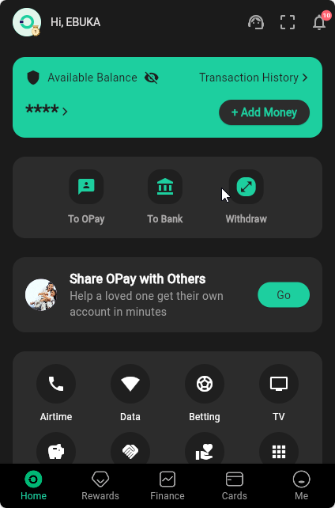

# OPay Wallet UI Clone (Flutter)

A stunning, modern **OPay-inspired** mobile wallet app UI built with Flutter. Features a clean dark theme, personalized home dashboard, balance card, quick actions, services grid, and a promotional share card – perfect for learning advanced Flutter layout techniques or as a foundation for a fintech app.

Fully responsive mobile design with realistic icons and asset usage.

## Screenshots

### Web Preview (Mobile images are coming)


### Home Screen 


## Features

- Beautiful dark-themed UI matching OPay's branding
- Personalized greeting with profile avatar and KYC badge
- Hidden balance with visibility toggle
- **Add Money** button and transaction history link
- Quick action buttons (Send, Receive, etc.)
- Promotional "Share OPay" referral card
- Comprehensive services grid (Airtime, Data, Electricity, etc.)
- Custom bottom navigation bar with asset-based icons
- Notification badge with unread count

## Tech Stack

- Flutter
- Dart

## Project Structure

```
lib/
├── constants/
│   └── color.dart                → App color palette (dark theme)
├── screens/
│   └── home_screen.dart          → Main dashboard
├── widgets/
│   ├── balance_card.dart         → Available balance with actions
│   ├── quick_actions_row.dart    → Send, Receive, Pay bills, etc.
│   ├── share_opay_card.dart      → Referral/promotion card
│   └── services_grid.dart        → Grid of services (Airtime, Betting, etc.)
└── main.dart                     → App entry point

assets/
└── icons/                        → OPay logo, KYC badge, nav icons, etc.
```

## How to Run

### Prerequisites
- Flutter SDK (≥3.0 recommended)
- Android/iOS emulator or physical device

### Setup & Run

```bash
# 1. Clone the repository
git clone https://github.com/yourusername/opay-wallet-ui-flutter.git
cd opay-wallet-ui-flutter

# 2. Get dependencies
flutter pub get

# 3. Run the app
flutter run
```

> Ensure your `pubspec.yaml` includes the assets:
```yaml
flutter:
  assets:
    - assets/icons/
```

## Color Palette

| Name               | Hex         | Usage                          |
|--------------------|-------------|--------------------------------|
| backgroundColor    | `#1B1B1B`   | Main background                |
| foregroundColor    | `#2C2C2C`   | Cards & buttons                |
| foregroundColor2   | `#1F1F1F`   | Darker accents                 |
| primary            | `#1DCF9F`   | OPay green accent              |
| text100            | `#ACAAAA`   | Secondary text                 |
| text200            | `#32AE8C`   | Highlight text                 |
| red                | `#FF6371`   | Notification badge             |
| icon100            | `#AAAAAA`   | Icons in app bar               |


## License

[MIT License](LICENSE) – Free to use and modify.

---

Built with ❤️ using Flutter – Star the repo if you found it helpful! 🚀